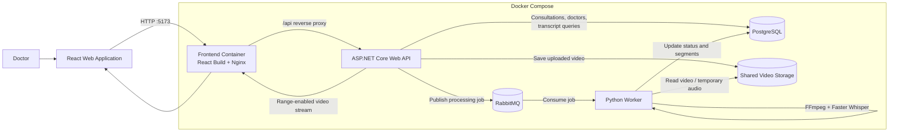
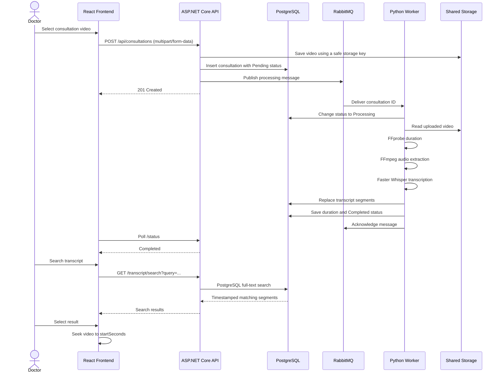
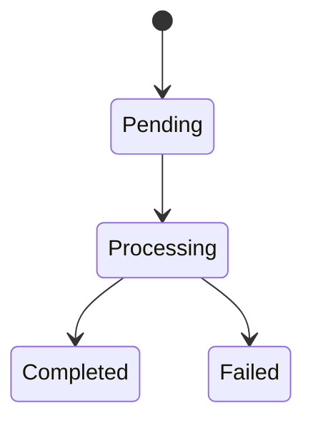
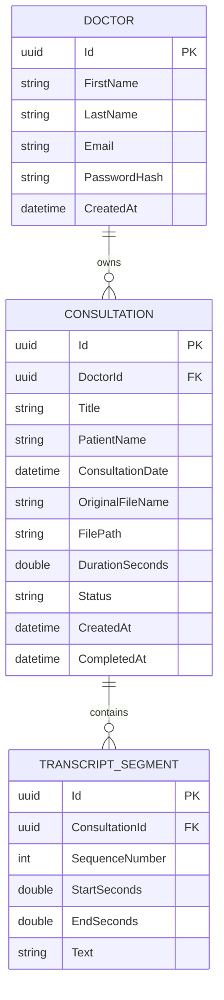

<div align="center">

# Telemedicine Consultation Indexer

### Search long consultation recordings and jump directly to the relevant moment

A full-stack, event-driven system that allows doctors to securely upload recorded consultations, process them asynchronously with Whisper, search indexed transcript segments, and navigate the video directly to matching timestamps.


</div>

---

## Table of Contents

- [Overview](#overview)
- [Problem and Solution](#problem-and-solution)
- [Key Features](#key-features)
- [System Architecture](#system-architecture)
- [Processing Workflow](#processing-workflow)
- [Technology Stack](#technology-stack)
- [Project Structure](#project-structure)
- [Data Model](#data-model)
- [API Endpoints](#api-endpoints)
- [Security and Reliability](#security-and-reliability)
- [Rate Limiting](#rate-limiting)
- [Docker Services](#docker-services)
- [Getting Started](#getting-started)
- [Environment Variables](#environment-variables)
- [Running the Application](#running-the-application)
- [Development Workflow](#development-workflow)
- [Logging and Error Handling](#logging-and-error-handling)
- [Important Design Decisions](#important-design-decisions)
- [Current Scope and Limitations](#current-scope-and-limitations)
- [Future Improvements](#future-improvements)
- [Author](#author)

---

## Overview

Reviewing a long medical consultation to locate one specific explanation, symptom, or medication discussion is slow and inefficient.

The **Telemedicine Consultation Indexer** solves this by combining a secure web application, an ASP.NET Core API, asynchronous RabbitMQ messaging, a Python processing worker, Whisper transcription, PostgreSQL full-text search, and range-based video streaming.

Doctors can:

1. Register and sign in.
2. Upload a recorded consultation.
3. Monitor its processing status.
4. Play the stored video securely.
5. Search the generated transcript.
6. Select a result and jump directly to its timestamp.
7. Delete consultations when they are no longer needed.

> **Project status:** the main end-to-end workflow is implemented and runs locally through Docker Compose.

---

## Problem and Solution

### The problem

A consultation recording may be 30–60 minutes long. Finding the exact moment where a doctor discussed a dosage, diagnosis, treatment plan, or symptom requires manually replaying and scanning the recording.

### The solution

The system automatically:

- stores the uploaded consultation video;
- publishes a processing job to RabbitMQ;
- extracts the audio with FFmpeg;
- transcribes it with Faster Whisper;
- stores timestamped transcript segments in PostgreSQL;
- indexes the transcript for full-text search;
- returns matching segments with start and end times;
- moves the video player directly to the selected result.

---

## Key Features

### Doctor authentication

- Doctor registration and login
- JWT bearer authentication
- Argon2id password hashing with per-password salts
- Persistent frontend authentication session
- Protected application routes
- Current-doctor profile endpoint
- Logout with video-cookie cleanup

### Consultation management

- Create consultations with title, patient name, date, and video
- List all consultations belonging to the authenticated doctor
- View consultation details and processing status
- Delete consultations with confirmation
- Prevent deletion while a consultation is actively processing
- Doctor-level ownership checks for every protected consultation operation

### Video upload and storage

- Multipart video upload
- Supported frontend formats: MP4, MOV, and MKV
- Maximum video size: **1 GB**
- Upload progress tracking
- Server, form, and Nginx request-size limits
- Safe generated storage keys instead of trusting the original filename
- Shared storage between the API and Python worker

### Asynchronous processing

- RabbitMQ processing queue
- Persistent processing messages
- Publisher confirmations
- Manual message acknowledgements
- Requeue handling for transient infrastructure failures
- Duplicate and terminal-state processing checks
- Background processing that keeps RabbitMQ heartbeats responsive

### AI transcription and media processing

- FFprobe duration extraction
- FFmpeg audio extraction
- Mono, 16 kHz PCM WAV generation
- Faster Whisper transcription
- Voice activity detection
- Timestamped transcript segments
- Temporary media cleanup after processing

### Search and playback

- PostgreSQL full-text search
- Timestamped search results
- Secure video playback
- HTTP range request support
- Seeking and direct navigation to transcript timestamps
- Status polling while processing is active
- Polling pauses when the browser tab is hidden

### API quality and observability

- Layered backend architecture
- Result pattern for expected failures
- Centralized exception handling
- RFC-style `ProblemDetails` responses
- Structured JSON console logging
- Correlation IDs, trace IDs, and doctor IDs in log scopes
- Request duration and status logging
- Sliding-window rate limiting
- Swagger/OpenAPI documentation in Development

---

## System Architecture



### Main components

| Component | Responsibility |
|---|---|
| React frontend | Authentication, dashboard, upload, status monitoring, playback, transcript search, and deletion |
| Nginx | Serves the production React build and proxies `/api` requests to the API container |
| ASP.NET Core API | Authentication, validation, authorization, storage, database operations, search, and job publishing |
| RabbitMQ | Decouples uploads from long-running transcription work |
| Python worker | Consumes jobs, extracts audio, transcribes recordings, and persists transcript segments |
| PostgreSQL | Stores doctors, consultations, statuses, metadata, and transcript segments |
| Shared storage | Makes uploaded videos available to both the API and worker |

---

## Processing Workflow



### Consultation status lifecycle



The data model also defines `DeletionRequested` for deletion coordination and worker-side processing safeguards.

---

## Technology Stack

### Frontend

| Technology | Usage |
|---|---|
| React 19 | User interface |
| Vite | Development server and production build |
| Redux Toolkit | Authentication and consultation state |
| React Redux | React bindings for Redux |
| React Router | Routing and protected routes |
| Axios | HTTP client and interceptors |
| React Hook Form | Form state and validation |
| CSS Modules | Component-scoped styling |
| Lucide React | Icons |
| Nginx | Static hosting and reverse proxy |

### Backend

| Technology | Usage |
|---|---|
| ASP.NET Core / .NET 10 | REST API |
| Entity Framework Core | Persistence and migrations |
| Npgsql | PostgreSQL provider |
| PostgreSQL full-text search | Transcript search |
| JWT Bearer Authentication | Protected API access |
| Argon2id | Password hashing |
| FluentValidation | Request validation |
| AutoMapper | DTO and model mapping |
| RabbitMQ.Client | Processing-job publishing |
| ASP.NET Core Rate Limiting | Endpoint-specific throttling |
| Swagger / OpenAPI | API documentation |
| `ProblemDetails` | Standardized API errors |

### Python worker

| Technology | Usage |
|---|---|
| Python 3.12 | Worker runtime |
| Faster Whisper | Speech-to-text transcription |
| CTranslate2 | Optimized Whisper inference |
| FFmpeg / FFprobe | Audio extraction and media inspection |
| Pika | RabbitMQ consumer |
| SQLAlchemy | Database access |
| Psycopg | PostgreSQL driver |
| Pydantic Settings | Environment configuration |
| ThreadPoolExecutor | Long-running processing outside the RabbitMQ I/O thread |

### Infrastructure

- Docker
- Docker Compose
- PostgreSQL 17
- RabbitMQ 4 with Management UI
- Bind-mounted consultation storage
- Health checks and service dependencies
- Multi-stage Docker builds

---

## Project Structure

```text
telemedicine-consultation-indexer/
├── backend/
│   └── TelemedicineConsultationIndexer/
│       ├── TelemedicineConsultationIndexer.slnx
│       └── src/
│           ├── TCI.Presentation/
│           │   ├── Authentication/
│           │   ├── Contracts/
│           │   ├── Controllers/
│           │   ├── Extensions/
│           │   ├── Middleware/
│           │   ├── Options/
│           │   ├── Dockerfile
│           │   └── Program.cs
│           │
│           ├── TCI.Business/
│           │   ├── Abstractions/
│           │   ├── Common/
│           │   ├── DTOs/
│           │   ├── Mappings/
│           │   ├── Models/
│           │   ├── Services/
│           │   ├── TechnicalServices/
│           │   └── Validators/
│           │
│           └── TCI.DataAccess/
│               ├── Entities/
│               ├── Enums/
│               ├── Persistence/
│               ├── Repositories/
│               └── UnitOfWork/
│
├── frontend/
│   ├── public/
│   ├── src/
│   │   ├── app/
│   │   ├── components/
│   │   ├── features/
│   │   ├── layout/
│   │   ├── pages/
│   │   ├── routes/
│   │   ├── services/
│   │   ├── styles/
│   │   └── utils/
│   ├── Dockerfile
│   ├── nginx.conf
│   ├── package.json
│   └── vite.config.js
│
├── python-worker/
│   ├── app/
│   │   ├── common/
│   │   ├── config/
│   │   ├── database/
│   │   ├── messaging/
│   │   ├── processing/
│   │   ├── services/
│   │   └── main.py
│   ├── Dockerfile
│   └── requirements.txt
│
├── storage/
│   └── consultations/          # Runtime video storage
│
├── docker-compose.yml
└── README.md
```

### Backend dependency direction

```text
TCI.Presentation
    ├── references TCI.Business
    └── references TCI.DataAccess for composition/startup

TCI.Business
    └── contains use cases, contracts, validation, and technical abstractions

TCI.DataAccess
    └── contains EF Core entities, repositories, configurations, migrations, and unit of work
```

Controllers remain thin: they translate HTTP input into business requests, call services, and map `Result` values into HTTP responses.

---

## Data Model



### Main entities

- **Doctor** — account and authentication data.
- **Consultation** — ownership, metadata, storage key, duration, and processing status.
- **TranscriptSegment** — ordered transcript text with start and end timestamps.

Transcript search is restricted to the selected consultation and implemented through PostgreSQL `to_tsvector` and web-search query functions.

---

## API Endpoints

Base URL during Docker execution:

```text
http://localhost:8080/api
```

The frontend accesses the same API through the Nginx proxy:

```text
http://localhost:5173/api
```

### Authentication

| Method | Endpoint | Authentication | Description |
|---|---|---:|---|
| `POST` | `/api/auth/register` | No | Register a doctor |
| `POST` | `/api/auth/login` | No | Authenticate and issue a JWT |
| `POST` | `/api/auth/logout` | No | Remove the video authentication cookie |

### Doctors

| Method | Endpoint | Authentication | Description |
|---|---|---:|---|
| `GET` | `/api/doctors/me` | Yes | Get the authenticated doctor |

### Consultations

| Method | Endpoint | Authentication | Description |
|---|---|---:|---|
| `POST` | `/api/consultations` | Yes | Upload and create a consultation |
| `GET` | `/api/consultations` | Yes | List the authenticated doctor’s consultations |
| `GET` | `/api/consultations/{consultationId}` | Yes | Get consultation details |
| `GET` | `/api/consultations/{consultationId}/status` | Yes | Get lightweight processing status |
| `GET` | `/api/consultations/{consultationId}/transcript` | Yes | Get the completed transcript |
| `GET` | `/api/consultations/{consultationId}/transcript/search?query=...` | Yes | Search transcript segments |
| `GET` | `/api/consultations/{consultationId}/video` | Yes | Stream the video with range processing |
| `DELETE` | `/api/consultations/{consultationId}` | Yes | Delete a consultation |

### Common response behavior

- `200 OK` — successful read or search
- `201 Created` — consultation or doctor created
- `204 No Content` — successful logout or deletion
- `400 Bad Request` — validation failure
- `401 Unauthorized` — missing or invalid authentication
- `404 Not Found` — resource missing or not owned by the current doctor
- `409 Conflict` — resource state does not allow the operation
- `413 Payload Too Large` — upload request exceeds the configured limit
- `429 Too Many Requests` — rate limit exceeded
- `500 Internal Server Error` — unexpected server failure
- `503 Service Unavailable` — required infrastructure is unavailable

When `ASPNETCORE_ENVIRONMENT=Development`, Swagger is available at:

```text
http://localhost:8080/swagger
```

---

## Security and Reliability

### Authentication and authorization

- JWT issuer, audience, signature, and expiration are validated.
- JWT lifetime validation uses zero clock skew.
- Consultation ownership is always derived from the authenticated doctor claim.
- Consultation IDs alone are never treated as authorization.
- Missing resources and resources owned by another doctor are represented as not found.

### Password protection

Passwords are hashed with **Argon2id** using:

- a random salt;
- configurable memory, iteration, and parallelism parameters;
- constant-time hash comparison.

Plaintext passwords are never stored.

### Secure video playback

Native browser `<video>` elements cannot easily attach the same Axios bearer header used by normal API requests.

The backend therefore also creates a restricted HTTP-only cookie after login or registration:

- unavailable to JavaScript;
- `SameSite=Strict`;
- scoped to the consultation API path;
- read by JWT authentication only for the consultation video endpoint.

The API returns a `FileStreamResult` with range processing enabled, allowing the browser to request only the required byte ranges.

### Upload protection

- 1 GB business file limit
- Request and multipart limits
- Nginx body-size and timeout configuration
- Extension/content-type validation
- Safe server-generated storage names
- Path traversal protection in the worker
- Stream-based upload and playback to avoid loading an entire large file into memory

### Messaging reliability

- Durable RabbitMQ queue
- Persistent messages
- Publisher confirmations
- Manual acknowledgement
- Prefetch count of one
- Requeue for transient database or infrastructure failures
- Discard invalid messages
- Duplicate and terminal-status checks
- RabbitMQ heartbeat handling during long transcription work

### Data and privacy

This is a training and portfolio project. Do not use real patient information or production medical recordings.

The repository does **not** claim HIPAA, GDPR, or any other healthcare-compliance certification.

---

## Rate Limiting

The API uses named sliding-window policies:

| Policy | Default limit | Window | Used for |
|---|---:|---:|---|
| `GeneralPolicy` | 100 requests | 1 minute | Standard protected endpoints |
| `AuthPolicy` | 5 requests | 1 minute | Login and logout |
| `UploadPolicy` | 5 requests | 10 minutes | Video upload |
| `SearchPolicy` | 30 requests | 1 minute | Transcript search |

Rate-limited responses return:

- HTTP `429`;
- a `Retry-After` header;
- a structured error response;
- a warning log with path, method, user, IP address, and retry delay.

---

## Docker Services

The application runs as five services on one Docker bridge network.

| Service | Container | Host port | Purpose |
|---|---|---:|---|
| Frontend | `tci-frontend` | `5173` | Nginx + React production build |
| API | `tci-api` | `8080` | ASP.NET Core API |
| PostgreSQL | `tci-postgres` | `5433` | Application database |
| RabbitMQ | `tci-rabbitmq` | `5672` | AMQP messaging |
| RabbitMQ Management | `tci-rabbitmq` | `15672` | Broker management UI |
| Python worker | `tci-python-worker` | — | Video processing and transcription |

### Persistence

- PostgreSQL data uses the named volume `postgres-data`.
- RabbitMQ data uses the named volume `rabbitmq-data`.
- Consultation videos use the host bind mount:

```text
./storage/consultations
```

Both the API and worker mount it as:

```text
/shared/storage/consultations
```

> Running `docker compose down -v` deletes the named PostgreSQL and RabbitMQ volumes. Use it only when intentionally resetting the environment.

---

## Getting Started

### Prerequisites

Install:

- Git
- Docker Desktop with Docker Compose
- .NET 10 SDK for applying EF Core migrations on a new database

Node.js and Python are not required for the Docker-based workflow because their runtimes are included in the images.

### 1. Clone the repository

```bash
git clone https://github.com/Duha-Maali/telemedicine-consultation-indexer.git
cd telemedicine-consultation-indexer
git checkout dev
```

### 2. Create the root `.env`

Create a file named `.env` beside `docker-compose.yml`:

```env
POSTGRES_DB=Telemedicine_Indexer
POSTGRES_USER=postgres
POSTGRES_PASSWORD=replace-with-a-strong-password

RABBITMQ_DEFAULT_USER=tci
RABBITMQ_DEFAULT_PASS=replace-with-a-strong-password

ASPNETCORE_ENVIRONMENT=Development

JWT_KEY=replace-with-a-long-random-secret-at-least-32-characters
JWT_ISSUER=TCI.Api
JWT_AUDIENCE=TCI.Frontend
```

Do not commit this file.

### 3. Create the storage directory

```bash
mkdir -p storage/consultations
```

On PowerShell:

```powershell
New-Item -ItemType Directory -Force storage/consultations
```

### 4. Start PostgreSQL and RabbitMQ

```bash
docker compose up -d postgres rabbitmq
```

Confirm that both services are healthy:

```bash
docker compose ps
```

### 5. Apply EF Core migrations

A fresh PostgreSQL database must be migrated before using the application.

From:

```text
backend/TelemedicineConsultationIndexer/src
```

run:

```bash
dotnet ef database update \
  --project TCI.DataAccess \
  --startup-project TCI.Presentation
```

The startup project requires a PostgreSQL connection string and JWT configuration.

<details>
<summary>PowerShell environment example</summary>

```powershell
$env:ConnectionStrings__DefaultConnection="Host=localhost;Port=5433;Database=Telemedicine_Indexer;Username=postgres;Password=replace-with-your-password"
$env:Jwt__Key="replace-with-the-same-long-random-secret"
$env:Jwt__Issuer="TCI.Api"
$env:Jwt__Audience="TCI.Frontend"

Set-Location backend/TelemedicineConsultationIndexer/src

dotnet ef database update `
  --project TCI.DataAccess `
  --startup-project TCI.Presentation

Set-Location ../../..
```

</details>

<details>
<summary>Bash environment example</summary>

```bash
export ConnectionStrings__DefaultConnection="Host=localhost;Port=5433;Database=Telemedicine_Indexer;Username=postgres;Password=replace-with-your-password"
export Jwt__Key="replace-with-the-same-long-random-secret"
export Jwt__Issuer="TCI.Api"
export Jwt__Audience="TCI.Frontend"

cd backend/TelemedicineConsultationIndexer/src

dotnet ef database update \
  --project TCI.DataAccess \
  --startup-project TCI.Presentation

cd ../../..
```

</details>

Install the EF Core command-line tool when it is not already available:

```bash
dotnet tool install --global dotnet-ef
```

---

## Environment Variables

### Docker Compose

| Variable | Required | Description |
|---|---:|---|
| `POSTGRES_DB` | Yes | PostgreSQL database name |
| `POSTGRES_USER` | Yes | PostgreSQL user |
| `POSTGRES_PASSWORD` | Yes | PostgreSQL password |
| `RABBITMQ_DEFAULT_USER` | Yes | RabbitMQ user |
| `RABBITMQ_DEFAULT_PASS` | Yes | RabbitMQ password |
| `ASPNETCORE_ENVIRONMENT` | Yes | ASP.NET Core environment |
| `JWT_KEY` | Yes | JWT signing secret |
| `JWT_ISSUER` | Yes | JWT issuer |
| `JWT_AUDIENCE` | Yes | JWT audience |

### Worker defaults in Compose

| Variable | Default |
|---|---|
| `RABBITMQ_PROCESSING_QUEUE` | `consultation.processing` |
| `FILE_STORAGE_ROOT` | `/shared/storage/consultations` |
| `WHISPER_MODEL_SIZE` | `small` |
| `WHISPER_DEVICE` | `cpu` |
| `WHISPER_COMPUTE_TYPE` | `int8` |

The first worker startup may take longer because Faster Whisper may need to download the configured model.

---

## Running the Application

### Build and start the complete stack

```bash
docker compose up -d --build
```

### Check container status

```bash
docker compose ps
```

### Open the services

| Service | URL |
|---|---|
| Web application | `http://localhost:5173` |
| API | `http://localhost:8080` |
| Swagger | `http://localhost:8080/swagger` |
| RabbitMQ Management | `http://localhost:15672` |

### Follow logs

All services:

```bash
docker compose logs -f
```

API:

```bash
docker compose logs -f api
```

Worker:

```bash
docker compose logs -f python-worker
```

Frontend:

```bash
docker compose logs -f frontend
```

### Stop the stack

```bash
docker compose down
```

### Rebuild one service

```bash
docker compose up -d --build frontend
```

```bash
docker compose up -d --build api
```

```bash
docker compose up -d --build python-worker
```

### Reset all persisted infrastructure data

```bash
docker compose down -v
```

This removes the PostgreSQL and RabbitMQ named volumes. Consultation files under `storage/consultations` are host files and must be deleted separately when a complete reset is intended.

---

## Development Workflow

### Frontend development server

Start the API and infrastructure, then run:

```bash
cd frontend
npm install
npm run dev
```

Vite runs on:

```text
http://localhost:5173
```

and proxies `/api` to:

```text
http://localhost:8080
```

### Frontend scripts

```bash
npm run dev
npm run lint
npm run build
npm run preview
```

### Backend local execution

From `backend/TelemedicineConsultationIndexer/src`:

```bash
dotnet restore
dotnet build
dotnet run --project TCI.Presentation
```

Configure the connection string, JWT settings, RabbitMQ settings, and storage path through environment variables, user secrets, or local configuration.

### Python worker local execution

The Docker workflow is recommended because the image installs FFmpeg and pins the required Python dependencies.

For local execution:

```bash
cd python-worker
python -m venv .venv
```

Activate the environment, install dependencies, configure `.env`, and run:

```bash
pip install -r requirements.txt
python -m app.main
```

FFmpeg and FFprobe must be available in the local system path.

---

## Logging and Error Handling

### Request logging

The presentation layer records:

- HTTP method;
- request path;
- response status;
- elapsed milliseconds;
- correlation ID;
- trace ID;
- authenticated doctor ID.

Swagger UI asset requests are excluded to reduce log noise.

### Correlation IDs

The API accepts or generates an:

```text
X-Correlation-Id
```

header and returns it to the client. The value is included in the logging scope so related events can be found across the request.

### Structured logging

The API uses JSON console logging with scopes and UTC timestamps. Docker captures these logs and makes them available through `docker compose logs`.

The worker logs:

- startup and dependency connections;
- RabbitMQ deliveries and acknowledgements;
- status changes;
- FFmpeg processing;
- Whisper model loading and transcription;
- database failures;
- cleanup operations.

### Exception handling

Unexpected exceptions are caught by centralized middleware, logged with their stack trace, and converted to:

```text
application/problem+json
```

Production responses hide internal exception details, while Development may include the exception message.

Expected business failures use the Result pattern and are mapped to controlled `400`, `404`, `409`, or `503` responses.

---

## Important Design Decisions

### 1. Asynchronous processing instead of blocking upload requests

Whisper transcription can take significantly longer than a normal HTTP request. The API saves the upload and publishes a message rather than waiting for transcription to finish.

Benefits:

- shorter upload request lifetime;
- clear separation between web and AI workloads;
- independent worker recovery;
- observable processing status;
- easier future worker scaling.

### 2. Shared storage for the current deployment model

The API writes uploaded videos to a host directory mounted into both containers.

This keeps the training setup simple while preserving a clean abstraction that can later be replaced by S3-compatible object storage.

### 3. Stream-based large-file handling

Uploads and video responses use streams rather than loading full videos into memory.

This is necessary for files approaching the 1 GB limit.

### 4. Restricted cookie for native video requests

Axios can attach JWT bearer tokens, while the native video element cannot use the same interceptor.

A restricted HTTP-only cookie authenticates only the video route without exposing the token to frontend JavaScript.

### 5. Range-enabled video responses

HTTP range processing enables:

- partial content responses;
- seeking before the full file is downloaded;
- direct jumps to transcript timestamps;
- more efficient large-video playback.

### 6. PostgreSQL full-text search

Transcript segments remain in the relational database and use PostgreSQL search functions rather than adding a separate search engine for the current project scale.

### 7. Separate RabbitMQ I/O and processing work

Whisper runs in a worker thread while the RabbitMQ connection remains responsive to heartbeats. Message acknowledgement is scheduled safely back onto the connection thread.

### 8. Layered backend design

The backend separates:

- HTTP concerns;
- business use cases and validation;
- technical services;
- persistence and repositories.

ASP.NET-specific upload types are translated into business-layer file abstractions before service execution.

---

## Screenshots

Add portfolio screenshots under:

```text
docs/screenshots/
```

Recommended screenshots:

1. Login or registration page
2. Dashboard and consultation statistics
3. Consultation list
4. Upload form and progress state
5. Processing state
6. Completed consultation with video player
7. Transcript search results
8. RabbitMQ Management queue
9. Docker Compose services

<!--
Example:

<p align="center">
  
</p>
-->

---

## Current Scope and Limitations

- This is an educational and portfolio project, not a certified medical system.
- Automated backend, worker, and frontend tests are not currently included.
- Video storage uses a local bind-mounted directory instead of object storage.
- The default worker runs one consultation at a time.
- The default Whisper setup uses CPU inference with the `small` model and `int8` compute.
- PostgreSQL search currently uses the English text-search configuration.
- CI/CD and public cloud deployment are not currently configured.
- There is no distributed tracing backend or centralized log platform.
- Production HTTPS, secret management, backup policies, and compliance controls require additional deployment work.

---

## Future Improvements

- Add backend integration tests with Testcontainers
- Add Python worker unit and integration tests
- Add frontend tests with Vitest and React Testing Library
- Add GitHub Actions for build, lint, and test validation
- Move videos to S3-compatible object storage
- Add dead-letter queues and explicit retry policies
- Add an outbox pattern for database/message consistency
- Add multiple worker replicas and workload-based scaling
- Add GPU-enabled Whisper processing
- Add configurable transcript languages and search dictionaries
- Add subtitle and transcript export
- Add email or in-app completion notifications
- Add OpenTelemetry tracing and centralized observability
- Add automatic migration execution for fresh Docker environments
- Add production reverse proxy, HTTPS, secret management, and backups

---

## Author

**Duha Maali**

- GitHub: [Duha-Maali](https://github.com/Duha-Maali)
- LinkedIn: [duha-maali](https://www.linkedin.com/in/duha-maali)

---

## License

This repository currently does not include an open-source license. Unless a license is added, the source code remains subject to the repository owner's copyright.

